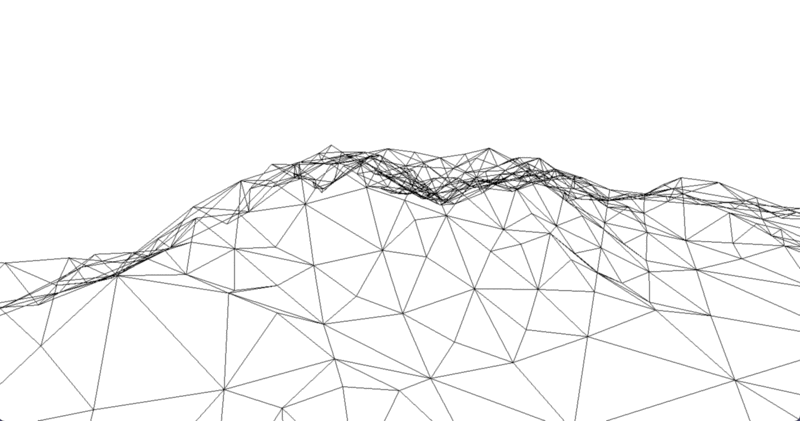

# gomartini




> a Go port of MARTINI for fast RTIN terrain mesh generation

[Installation](#installation) | [Getting Up and Running](#getting-up-and-running) | [Examples](#examples) | [See Also](#see-also)

gomartini is a Go port of [Mapbox's Awesome Right-Triangulated Irregular Networks, Improved (MARTINI)](https://github.com/mapbox/martini). The main features are:

- Real-time terrain mesh generation from height data. Given a (2k+1) × (2k+1) terrain grid, it generates a hierarchy of triangular meshes of varying levels of detail in milliseconds.


## Installation

```bash
go get github.com/e-k-m/gomarini
```

## Getting Up and Running

```bash
# 1. Install mage (see here: https://github.com/magefile/mage)
# 2. Install development tools using
mage -v deps
# 2. See tasks/targets via
mage
# call in project root and then call the ones needed, or just use go tools.
```

## Examples

```go
// set up mesh generator for a certain 2^k+1 grid size
m := martini.New(257)

// generate RTIN hierarchy from terrain data (a slice of 2^k+1^2 length)
tile := m.CreateTile(terrain)

// get a mesh (vertices and triangles indices) for a 5m error
vertices, triangles := tile.GetMesh(5)
```

## See Also

- [Reference Mapbox MARTINI implementation](https://github.com/mapbox/martini)

- [Python MARTINI port](https://github.com/kylebarron/pymartini)